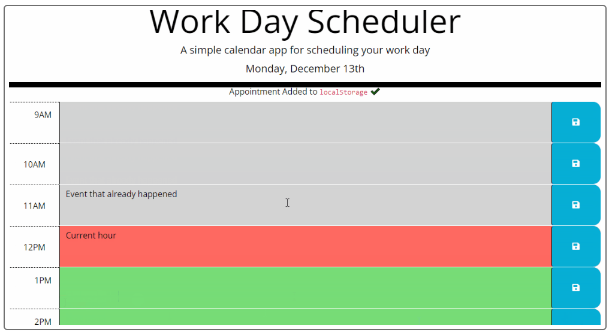

# Work Day Scheduler

## User Story

 

AS AN employer with a busy schedule
I WANT to add important events to a daily planner
SO THAT I can manage my time effectively

# Acceptance Criteria

GIVEN I am using a daily planner to create a schedule
 

<ul>
<li>WHEN I open the planner</li>
<li>THEN the current day is displayed at the top of the calendar</li>
<li>WHEN I scroll down</li>
<li>THEN I am presented with time blocks for standard business hours</li>
<li>WHEN I view the time blocks for that day</li>
<li>THEN each time block is color-coded to indicate whether it is in the past, present, or future</li>
<li>WHEN I click into a time block</li>
<li>THEN I can enter an event</li>
<li>WHEN I click the save button for that time block</li>
<li>THEN the text for that event is saved in local storage</li>
<li>WHEN I refresh the page</li>
<li>THEN the saved events persist</li>
</ul>

[Deployed Site](https://levimendyk.github.io/work-day-schedule/)

Contribution guidelines for this project

